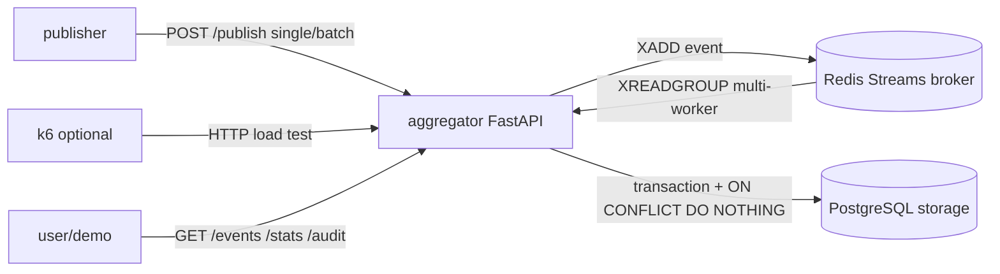

# UAS Sistem Terdistribusi - Pub-Sub Log Aggregator

Implementasi UAS Sistem Terdistribusi bertema **Pub-Sub Log Aggregator Terdistribusi dengan Idempotent Consumer, Deduplication, dan Transaksi/Kontrol Konkurensi**. Sistem dibuat dengan Python, FastAPI, Redis Streams, PostgreSQL, Docker Compose, pytest, dan K6 opsional untuk HTTP load testing.

## Submission

- Repository: https://github.com/azpradipta/uas-sister
- Video demo: https://youtu.be/BvaZYEFNVRY
- Laporan: [report.md](./report.md)
- Bahasa pemrograman: Python
- Runtime utama: Docker Compose lokal

## Arsitektur



Komponen Compose:

- `aggregator`: FastAPI API, internal consumer worker, stats, audit log, health/readiness endpoint.
- `publisher`: generator/simulator event batch, termasuk duplikasi minimal 30 persen untuk benchmark.
- `broker`: Redis Streams sebagai broker internal dan buffer at-least-once.
- `storage`: PostgreSQL 16 sebagai dedup store persisten dengan named volume `pg_data`.
- `k6`: load testing HTTP opsional melalui Compose profile `k6`.

Redis dan PostgreSQL tidak membuka port ke host. Hanya aggregator yang diekspos di `http://localhost:8080` untuk demo lokal.

## Fitur Utama

- `POST /publish`: menerima single event atau batch event.
- `GET /events?topic=...`: menampilkan event unik yang telah diproses.
- `GET /stats`: menampilkan `received`, `unique_processed`, `duplicate_dropped`, `duplicate_rate`, `topics`, dan `uptime_seconds`.
- `GET /audit`: menampilkan jejak event `processed` atau `duplicate`.
- `GET /healthz` dan `GET /readyz`: health/readiness check.
- Dedup persisten dengan unique constraint `(topic, event_id)`.
- Transaksi database saat pemrosesan event.
- Idempotent write pattern memakai `INSERT ... ON CONFLICT DO NOTHING`.
- Multi-worker consumer dengan Redis Streams consumer group.
- Crash recovery dengan ack setelah commit dan `XAUTOCLAIM` untuk pending/stale message.
- Test suite 20 test, sesuai ketentuan 12-20 tests.

## Model Event

```json
{
  "topic": "auth.login",
  "event_id": "evt-001",
  "timestamp": "2026-01-01T00:00:00Z",
  "source": "publisher-1",
  "payload": {
    "level": "INFO",
    "message": "login success"
  }
}
```

Aturan:

- `topic` adalah namespace log, misalnya `auth.login`, `payments`, `inventory`, atau `system.metrics`.
- `event_id` unik per topic.
- Identitas dedup adalah pasangan `(topic, event_id)`.
- `payload` harus berupa JSON object.

## Endpoint

| Method | Endpoint | Fungsi |
|---|---|---|
| `POST` | `/publish` | Menerima single/batch event dan memasukkannya ke Redis Streams. |
| `GET` | `/events?topic=...&limit=...&offset=...` | Melihat event unik yang sudah diproses. |
| `GET` | `/stats` | Melihat metrik processing attempt, event unik, duplicate, topic, dan uptime. |
| `GET` | `/audit?limit=...` | Melihat audit log processed/duplicate. |
| `GET` | `/healthz` | Health check ringan. |
| `GET` | `/readyz` | Readiness check database dan broker. |
| `GET` | `/docs` | Swagger UI FastAPI. |

## Quick Start

Jalankan stack utama sesuai instruksi tugas:

```powershell
docker compose up --build
```

Alternatif background mode:

```powershell
docker compose up --build -d aggregator
```

Akses aggregator:

```text
http://localhost:8080
```

Cek readiness dan stats:

```powershell
curl.exe http://localhost:8080/readyz
curl.exe http://localhost:8080/stats
```

Swagger UI:

```powershell
Start-Process 'http://localhost:8080/docs'
```

## Contoh Publish Manual

```powershell
$body = @{
  topic = 'auth.login'
  event_id = 'manual-1'
  timestamp = '2026-01-01T00:00:00Z'
  source = 'manual'
  payload = @{ message = 'hello' }
} | ConvertTo-Json -Depth 5

Invoke-RestMethod -Uri 'http://localhost:8080/publish' -Method Post -ContentType 'application/json' -Body $body
```

Cek hasil:

```powershell
Invoke-RestMethod -Uri 'http://localhost:8080/events?topic=auth.login&limit=5' | ConvertTo-Json -Depth 10
Invoke-RestMethod -Uri 'http://localhost:8080/stats' | ConvertTo-Json -Depth 10
```

Kirim event yang sama lagi untuk membuktikan dedup:

```powershell
Invoke-RestMethod -Uri 'http://localhost:8080/publish' -Method Post -ContentType 'application/json' -Body $body
Invoke-RestMethod -Uri 'http://localhost:8080/audit?limit=5' | ConvertTo-Json -Depth 10
```

Ekspektasi: `received` bertambah, `unique_processed` tidak bertambah untuk event yang sama, dan `duplicate_dropped` bertambah.

## Load Test 20.000 Event

Publisher default mengirim 20.000 event dengan duplicate rate 0,30.

```powershell
docker compose --profile load run --rm publisher
```

Override eksplisit:

```powershell
docker compose --profile load run --rm `
  -e TOTAL_EVENTS=20000 `
  -e DUPLICATE_RATE=0.30 `
  -e BATCH_SIZE=500 `
  -e CONCURRENCY=4 `
  -e SOURCE=publisher-20k `
  -e SEED=publisher-20k `
  publisher
```

Pantau stats:

```powershell
Invoke-RestMethod -Uri 'http://localhost:8080/stats' | ConvertTo-Json -Depth 10
```

Catatan metrik:

- `received` adalah jumlah processing attempt yang dikonsumsi worker.
- Dalam at-least-once delivery, `received` bisa sedikit lebih tinggi dari jumlah event dikirim jika ada redelivery.
- Kebenaran dedup dilihat dari `unique_processed`, `duplicate_dropped`, dan isi `/events`.

## K6 HTTP Load Test Opsional

K6 disediakan karena soal memberi catatan contoh penggunaan K6.

```powershell
docker compose --profile k6 run --rm k6
```

Override beban K6:

```powershell
docker compose --profile k6 run --rm `
  -e K6_RATE=50 `
  -e K6_DURATION=3m `
  -e BATCH_SIZE=100 `
  -e DUPLICATE_RATE=0.30 `
  k6
```

Script K6 berada di [loadtest/k6-publish.js](./loadtest/k6-publish.js). Publisher Python tetap menjadi simulator event utama, sedangkan K6 dipakai untuk metrik HTTP seperti request rate, latency, dan error rate.

## Persistence dan Crash/Recreate

Gunakan `SEED` yang sama agar publisher menghasilkan event id yang sama.

```powershell
docker compose --profile load run --rm `
  -e TOTAL_EVENTS=1000 `
  -e DUPLICATE_RATE=0.30 `
  -e SOURCE=demo-persistence `
  -e SEED=uas-demo `
  publisher
```

Recreate aggregator:

```powershell
docker compose up -d --force-recreate aggregator
```

Kirim ulang event deterministic yang sama:

```powershell
docker compose --profile load run --rm `
  -e TOTAL_EVENTS=1000 `
  -e DUPLICATE_RATE=0.30 `
  -e SOURCE=demo-persistence `
  -e SEED=uas-demo `
  publisher
```

Hasil yang diharapkan: run kedua menambah `received` dan `duplicate_dropped`, tetapi event unik yang sama tidak diproses ulang. Ini membuktikan dedup store persisten di PostgreSQL volume `pg_data`.

## Menjalankan Tests

Install dependency lokal:

```powershell
python -m pip install -r requirements-dev.txt
```

Jalankan test:

```powershell
python -m pytest -q
```

Verifikasi terakhir:

```text
20 passed in 12.65s
```

Cakupan test:

- Validasi schema event.
- Single dan batch publish.
- Dedup event duplikat.
- Event id sama pada topic berbeda.
- Persistence dedup state setelah storage dibuka ulang.
- Konkurensi 50 proses pada event yang sama.
- Stress kecil 300 event.
- Konsistensi `/stats` dan `/events`.

## Keputusan Desain Ringkas

- Delivery model: at-least-once, bukan exactly-once end-to-end.
- Correctness utama: exactly-once effect untuk event unik melalui idempotent consumer.
- Dedup key: `(topic, event_id)`.
- Storage: PostgreSQL dengan named volume `pg_data`.
- Isolation: PostgreSQL `READ COMMITTED`, diperkuat unique constraint dan atomic upsert.
- Counter statistik: SQL atomic increment `value = value + 1`.
- Ordering: timestamp producer + logical sequence database, bukan total ordering global.
- Security/network: Redis dan PostgreSQL hanya di Compose internal network.

## File Penting

- `aggregator/`: kode aggregator FastAPI dan Dockerfile.
- `publisher/`: kode publisher simulator dan Dockerfile.
- `loadtest/k6-publish.js`: script K6 opsional.
- `tests/`: 20 automated tests.
- `docker-compose.yml`: orchestration semua service.
- `report.md`: laporan UAS.
- `requirements-dev.txt`: dependency test lokal.

## Membersihkan Container

Stop tanpa menghapus data:

```powershell
docker compose down
```

Hapus container dan volume data:

```powershell
docker compose down -v
```

Gunakan `down -v` hanya jika ingin menghapus bukti persistence.
