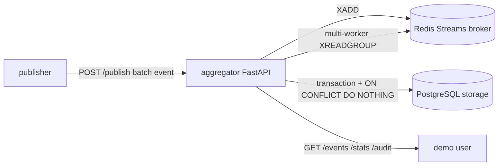

# UAS Sistem Terdistribusi - Pub-Sub Log Aggregator

Proyek ini adalah implementasi Python untuk UAS Sistem Terdistribusi: pub-sub log aggregator multi-service dengan idempotent consumer, deduplication persisten, dan transaksi/kontrol konkurensi.

## Arsitektur



Komponen:

- `aggregator`: FastAPI API, consumer worker internal, stats, audit log.
- `publisher`: simulator yang mengirim event batch, termasuk duplikasi.
- `broker`: Redis Streams internal untuk at-least-once delivery.
- `storage`: PostgreSQL 16 dengan named volume `pg_data`.

Redis dan PostgreSQL tidak membuka port host. Hanya aggregator yang diekspos di `http://localhost:8080`.

## Fitur Utama

- `POST /publish`: menerima single event atau batch event.
- `GET /events?topic=...`: menampilkan event unik yang sudah diproses.
- `GET /stats`: menampilkan `received`, `unique_processed`, `duplicate_dropped`, `topics`, dan uptime.
- `GET /audit`: audit sederhana untuk melihat event `processed` atau `duplicate`.
- Dedup persisten memakai unique constraint `(topic, event_id)`.
- Transaksi database memakai `INSERT ... ON CONFLICT DO NOTHING` agar dua worker paralel tidak bisa memproses event yang sama dua kali.
- Redis Streams memakai consumer group dan `XACK` setelah transaksi database selesai.
- `XAUTOCLAIM` dipakai untuk mengambil ulang pesan stale jika worker/container crash sebelum ack.

## Model Event

```json
{
  "topic": "auth.login",
  "event_id": "evt-001",
  "timestamp": "2026-01-01T00:00:00Z",
  "source": "publisher-1",
  "payload": {
    "level": "INFO",
    "message": "login success"
  }
}
```

`event_id` unik per `topic`. Jadi `event_id` yang sama masih boleh muncul di topic berbeda.

## Menjalankan dengan Docker Compose

Build dan jalankan service utama:

```powershell
docker compose up --build -d aggregator
```

Cek readiness:

```powershell
curl.exe http://localhost:8080/readyz
curl.exe http://localhost:8080/stats
```

Kirim satu event:

```powershell
curl.exe -X POST http://localhost:8080/publish `
  -H "Content-Type: application/json" `
  -d "{\"topic\":\"auth.login\",\"event_id\":\"manual-1\",\"timestamp\":\"2026-01-01T00:00:00Z\",\"source\":\"manual\",\"payload\":{\"message\":\"hello\"}}"
```

Jalankan publisher default untuk 20.000 event dengan sekitar 30 persen duplikasi:

```powershell
docker compose --profile load run --rm publisher
```

Opsional, jalankan HTTP load test dengan K6:

```powershell
docker compose --profile k6 run --rm k6
```

K6 memakai script [loadtest/k6-publish.js](./loadtest/k6-publish.js), mengirim batch event ke `POST /publish`, dan tetap memakai duplicate rate 30 persen. Service K6 berjalan di jaringan Compose dan menargetkan `http://aggregator:8080/publish`.

Contoh override beban K6:

```powershell
docker compose --profile k6 run --rm `
  -e K6_RATE=50 `
  -e K6_DURATION=3m `
  -e BATCH_SIZE=100 `
  -e DUPLICATE_RATE=0.30 `
  k6
```

Pantau hasil:

```powershell
curl.exe http://localhost:8080/stats
curl.exe "http://localhost:8080/events?topic=auth.login&limit=5"
curl.exe "http://localhost:8080/audit?limit=10"
```

Catatan: `received` adalah jumlah processing attempt yang dikonsumsi worker. Pada model at-least-once, angka ini bisa sedikit lebih tinggi dari jumlah event yang dikirim jika ada redelivery. Kebenaran dedup dilihat dari `unique_processed` dan isi `/events`.

## Demo Persistence Setelah Recreate

Gunakan `SEED` yang sama agar publisher menghasilkan event yang sama pada run kedua.

```powershell
docker compose --profile load run --rm `
  -e TOTAL_EVENTS=1000 `
  -e DUPLICATE_RATE=0.30 `
  -e SOURCE=demo-persistence `
  -e SEED=uas-demo `
  publisher
```

Recreate aggregator:

```powershell
docker compose up -d --force-recreate aggregator
```

Kirim ulang event deterministic yang sama:

```powershell
docker compose --profile load run --rm `
  -e TOTAL_EVENTS=1000 `
  -e DUPLICATE_RATE=0.30 `
  -e SOURCE=demo-persistence `
  -e SEED=uas-demo `
  publisher
```

Hasil yang harus terlihat di `/stats`: run kedua menambah `received`, tetapi mayoritas event yang sudah pernah unik akan masuk `duplicate_dropped`, bukan `unique_processed`. Ini bukti dedup store persisten di volume PostgreSQL.

## Menjalankan Test

Install dependency lokal:

```powershell
python -m pip install -r requirements-dev.txt
```

Jalankan test:

```powershell
python -m pytest -q
```

Verifikasi terakhir di mesin ini:

```text
20 passed in 20.50s
```

Test memakai SQLite sementara agar bisa jalan cepat tanpa Docker, tetapi pola dedup-nya sama: transaksi + unique constraint + idempotent insert. Saat Compose berjalan, storage yang dipakai adalah PostgreSQL.

## File Penting

- `aggregator/app/main.py`: definisi API dan lifecycle worker.
- `aggregator/app/database.py`: transaksi, schema, stats, audit, dedup.
- `aggregator/app/queue.py`: Redis Streams publish/read/ack/claim.
- `aggregator/app/consumer.py`: multi-worker consumer.
- `publisher/publisher.py`: generator event duplikat dan load sender.
- `loadtest/k6-publish.js`: script K6 opsional untuk HTTP load test.
- `tests/`: 20 test untuk validasi skema, dedup, persistence, concurrency, stats, dan API.
- `report.md`: draft laporan UAS.
- `DEMO_GUIDE.md`: urutan narasi video minimal 25 menit.
- `DEMO_SCRIPT_FULL.md`: skrip bacaan dan command demo yang bisa dicopy.

## Membersihkan Container

Stop tanpa menghapus data:

```powershell
docker compose down
```

Hapus container dan volume data:

```powershell
docker compose down -v
```

Gunakan `down -v` hanya kalau ingin menghapus bukti persistence.
